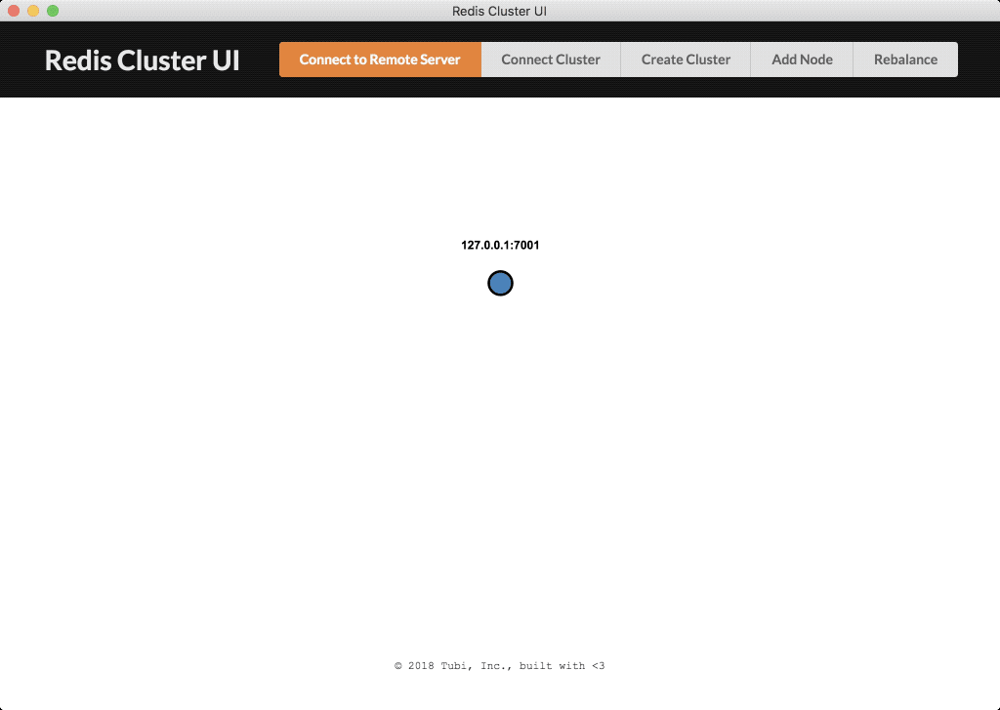

# Redis Cluster UI

Native UI app for easy mange and monitor Redis Cluster

## Demo

Create cluster

Add node

Setup master/slave relationship

Node info

## Development

* `brew install redis`
* `cd ./playground && ./start.sh`
* `npm install && npm start`
